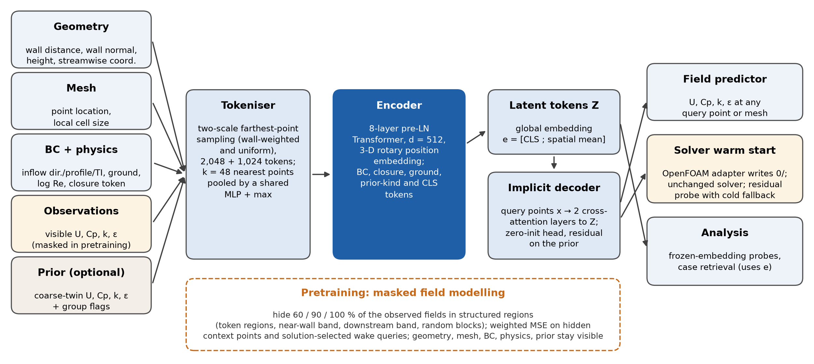

# CFD2vec

A self-supervised pretraining architecture for 3-D steady and time-averaged flows, built as a general foundation
model: one encoder is pretrained by **masked field modelling** on solved cases; the learned representation then
serves field prediction at arbitrary query points, solver warm start (super-fidelity), frozen-embedding probes and
case retrieval. The core is independent of any solver or dataset: solvers and data sources are plug-ins.



Scope: incompressible or low-Mach, steady RANS or time-averaged scale-resolving, 3-D external and urban flows.

## Install

```bash
conda create -n cfd2vec python=3.12 -y && conda activate cfd2vec
pip install -r requirements.txt
pip install -e . --no-deps
pytest -q
cfd2vec device-check             # accelerator check -> runs/device_check.json
```
`conda env create -f environment.yml` does the same in one step.

## Training CFD2vec-S (32.5 M parameters)

```bash
bash scripts/train_S.sh                          # masked field modelling -> runs/S_urban_v2_masked
OBJECTIVE=supervised bash scripts/train_S.sh     # supervised control     -> runs/S_urban_v2_supervised
```
The device is chosen automatically (cuda, then mps, then cpu); `DEVICE=mps` forces one. Re-running the same command
resumes from `runs/<name>/last.pt`; Ctrl-C saves and exits cleanly. Recommended: set `batch_size` in
`configs/pretrain_S_urban.yaml` from `cfd2vec device-check` and keep `max_steps` fixed for the whole run.
Progress: `runs/<name>/status.json` (live state, ETA, throughput, memory, last evaluation), `log.jsonl`, `train.log`.
`run.json` records the resolved configuration and provenance, and the realised token coverage and effective radii
per scale on the training shards (next to the nominal radii r1, r2).

## Quick start

Pre-trained model: [CFD2vec-31M on Hugging Face](https://huggingface.co/sensifai/cfd2vec)

```python
from cfd2vec import CFD2vec, Conditioning
from cfd2vec.solvers import get_adapter

m = CFD2vec.from_pretrained("runs/pilot_masked/best.pt")
of = get_adapter("openfoam")
cond = Conditioning(closure="k-epsilon", abl_alpha=0.22, turb_intensity=0.07, ground="stationary",
                    inflow_dir=(1, 0, 0), rotation_ok=True)
case = of.read_case("path/to/case", U_ref=0.93, L_ref=None, cond=cond)    # L_ref=None -> mean building height

pred = m.predict(case)                          # normalised U, Cp, k, eps on every cell
phys = m.to_physical(pred["fields"], case)      # U [m/s], p [m^2/s^2], k, epsilon, omega
emb  = m.encode(case)["embedding"]              # frozen representation for probes / retrieval
m.finetune(["shard_0.npz", "..."])              # few-shot adaptation under the packaged frozen protocol
```

Warm start with the residual-checked fallback (the solver and its numerics are not modified):

```python
from cfd2vec.tasks.warmstart import warm_start, SeedPolicy, SafetyPolicy
warm_start(m.net, of, "path/to/case", U_ref=0.93, L_ref=None, cond=cond,
           seed_policy=SeedPolicy(fields=("U",)),          # velocity-only seeding is the recommended default
           safety=SafetyPolicy(probe_iter=25),              # probe, then continue or restore and run cold
           prior_dir="path/to/coarse_case",                 # optional low-fidelity prior
           run=True, env_setup="source /opt/openfoam14/etc/bashrc")
```

## Command line

```bash
cfd2vec pretrain  --config configs/pretrain_pilot.yaml --out runs/pilot_masked [--objective supervised]
cfd2vec finetune  --init runs/pilot_masked/best.pt --cases <N shard paths> --out runs/ft_N10_s0 --seed 0
cfd2vec evaluate  --ckpt runs/pilot_masked/best.pt --cases <shards> --out results/test.csv --use-prior
cfd2vec warmstart --ckpt runs/pilot_masked/best.pt --case-dir <case> --U-ref 0.93 --L-ref 0 --fields U
cfd2vec export-onnx --ckpt runs/pilot_masked/best.pt --out cfd2vec.onnx
```
